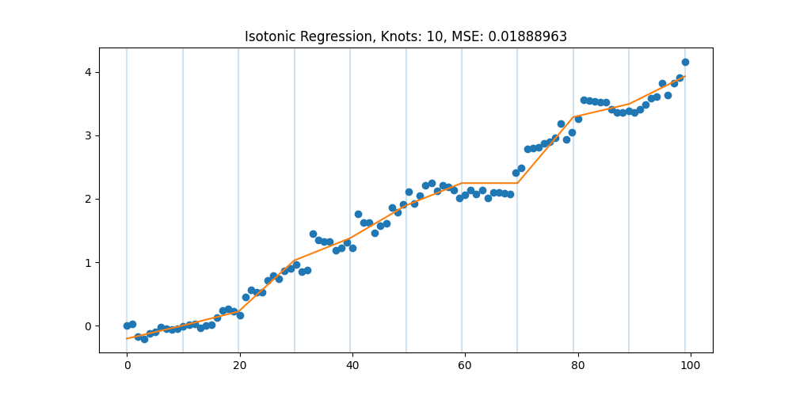

<h1 align="center">

</h1><br>

A simple python library of regression models.

## Example Usage

Linear regression.

```
import numpy as np
import matplotlib.pyplot as plt
from regressio.models import linear_regression
from regressio.datagen import generate_random_walk

np.random.seed(1)
plt.rcParams['figure.figsize'] = (10, 5)

x, y = generate_random_walk(100)

model = linear_regression(degree=10)
model.fit(x, y, plot=True)
```


Isotonic regression.

```
import numpy as np
import matplotlib.pyplot as plt
from regressio.models import isotonic_regression
from regressio.datagen import generate_isotonic_sample

np.random.seed(1)
plt.rcParams['figure.figsize'] = (10, 5)

x, y = generate_isotonic_sample(100)

model = isotonic_regression(knots=10)
model.fit(x, y, plot=True)
```


More examples to come in the [notebooks folder](notebooks/).
