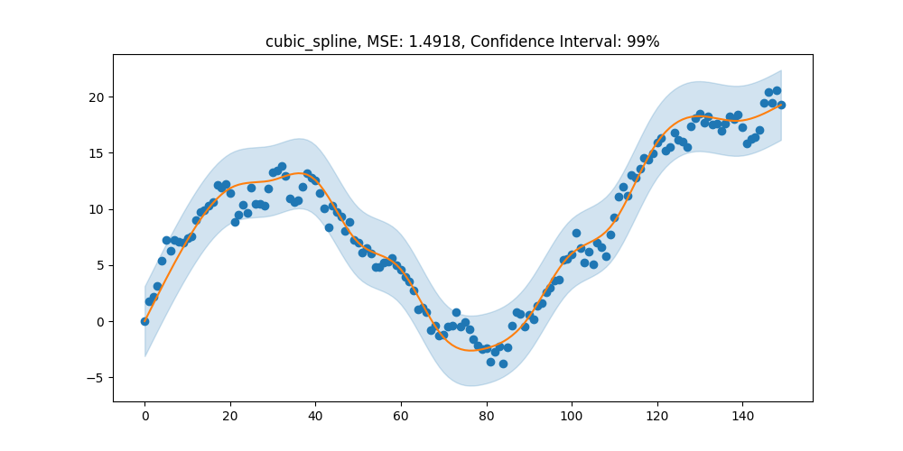
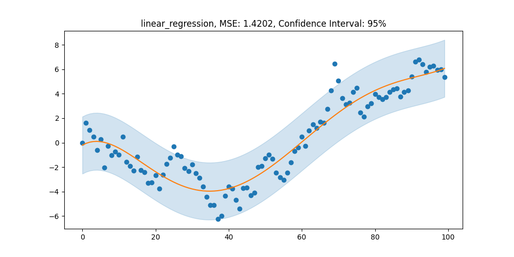

<h1 align="center">

</h1><br>

## Overview

Regressio is a python module for univariate regression and interpolation models.

The available models are:
- Linear Regression
- Linear Spline
- Isotonic Regression
- Bin Regression
- Cubic Spline

There are also functions implemented to generate data samples.

The available data generators are:
- Random Walk
- Isotonic Sample

## Installation

Regressio is supported in Python 3.6+ or above and requires only NumPy and Matplotlib.

`pip install coming soon..`

## Example Usage

Cubic spline. 

```python
# Importing required modules + classes
from regressio.models import cubic_spline
from regressio.datagen import generate_random_walk
import numpy as np
import matplotlib.pyplot as plt

# Setting figsize and seed
plt.rcParams['figure.figsize'] = (10, 5)
np.random.seed(0)

# Generating data sample
x, y = generate_random_walk(150)

# Fit model and plot result
model = cubic_spline(pieces=15)
model.fit(x, y, plot=True)
```


Linear regression.

```python
# Importing required modules + classes
from regressio.models import linear_regression
from regressio.datagen import generate_random_walk
import numpy as np
import matplotlib.pyplot as plt

# Setting figsize and seed
plt.rcParams['figure.figsize'] = (10, 5)
np.random.seed(1)

# Generating data sample
x, y = generate_random_walk(100)

# Fit model and plot result
model = linear_regression(degree=5)
model.fit(x, y, plot=True)
```


Isotonic regression.

```python
# Importing required modules + classes
from regressio.models import isotonic_regression
from regressio.datagen import generate_isotonic_sample
import numpy as np
import matplotlib.pyplot as plt

# Setting figsize and seed
plt.rcParams['figure.figsize'] = (10, 5)
np.random.seed(4)

# Generating data sample
x, y = generate_isotonic_sample(100)

# Fit model and plot result
model = isotonic_regression(knots=12)
model.fit(x, y, plot=True)
```


For more examples, navigate to the examples.ipynb file in this repository.
